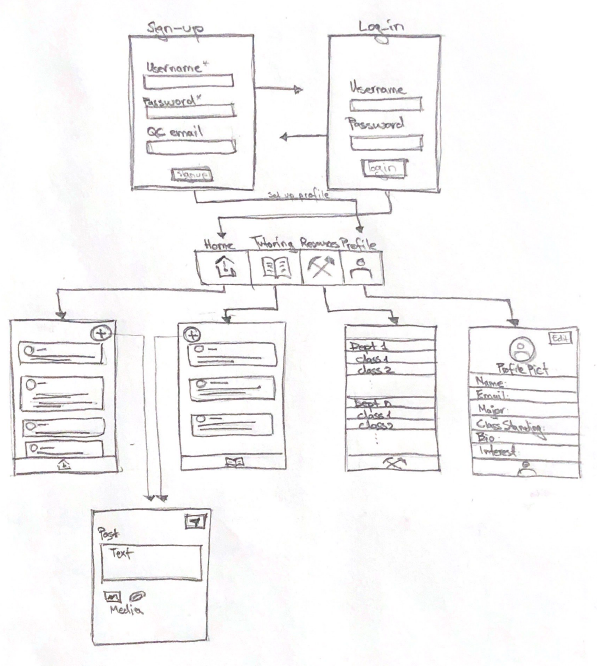
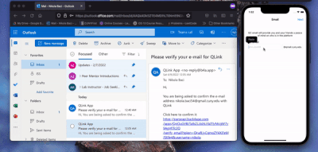
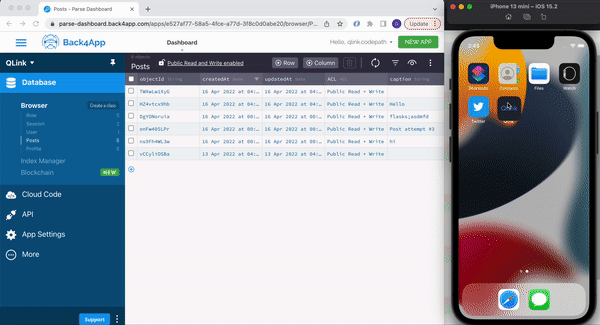

Original App Design Project - README Template
===

# Qlinks

## Table of Contents
1. [Overview](#Overview)
1. [Product Spec](#Product-Spec)
1. [Wireframes](#Wireframes)
2. [Schema](#Schema)

## Overview
### Description
An app where students can join and share tips, tricks, past exams, join discussion boards, keep up to date with campus wide updates and meet study-buddies.

### App Evaluation
- **Category:** Social Networking 
- **Mobile:** This app would be primarily developed for mobile but would perhaps be just as viable on a computer, such as Reddit or other similar apps. Functionality would be same across all devices.
- **Story:** Connects Queens College students. The users can post their interests and engage with other with similar interests. In addition students can post resources, tutoring services, and additional help posts.
- **Market:** Current Students enrolled in Queen College. 
- **Habit:** This app could be used as often or unoften as the user wanted depending on how deep their social life is, and what exactly they’re looking for.
- **Scope:** At first we will start as a social app for students enrolled in Queens College, interested in Computer Science. This can evolve into a larger app which includes all CUNY/SUNY students and multiple departments.  

## Product Spec

### 1. User Stories (Required and Optional)
**Required Must-have Stories**
- Users can Sign up/ Log in with a valid QC email.
- Users can interact with posts of their interest.
- Users can interact with class resources uploaded by their peers.
- A live chat window to post miscellaneous comments/services.
- Profile pages for each user


### 2. Screen Archetypes
- Initial Screen
- Login Screen
    - User stays logged in across restarts.
- Signup Screen
    - User signs up with QC email 
    - Email has to be verified before entering the account
- Home Feed Screen
  - Allows users to create a post and interact with other posts. 
- Resources Screen 
  - Allows user to create and interact with resources of different Computer Science courses.
- Tutoring Chat
  - A live chat where students can post tutoring services/inqueries.
- Profile Screen
  -Allows user to upload a photo and fill in information that is interesting to them and others
  
### 3. Navigation

**Tab Navigation** (Tab to Screen)

* Profile
* Feed
* Resources
* Tutoring

**Flow Navigation** (Screen to Screen)
* Initial Screen
    * Login Screen
    * Signup Screen
* Login Screen
    * Home Screen
* Signup Screen
    * Profile Screen
* Home Screen
    * Profile Screen
    * Post Screen
    * Tutoring Screen
    * Resources Screen
* Tutoring
    * Profile Screen
    * Post Screen
    * Home Screen
    * Resources Screen
* Resources
    * Profile Creen
    * Tutoring
    * Post Screen
    * Home Screen
* Profile
    * Tutoring
    * Post Screen
    * Home Screen
    * Resources Screen


## Wireframes


### Digital Wireframes & Mockups
### Interactive Prototype

## Schema 
PFUser

|Property       |Type               |Description
|---------      |---------          |---------
|username       |String             |QC email
|emailVerified  |Bool               |Only enter the app if true
|email          |String             |Same as username
|bio            |String             |User can tell more about themselves
|classStanding  |String             |The academic year the user is currently
|profileImage   |PFFileObject       |Initially an avatar, will hold user's profile picture
|screenName     |String             |User's name shown to other users
|major          |String             |Major that user is persuing


Post

|Property       |Type               |Description
|---------      |---------          |---------


### Networking

**List of network requests by screen**

**Signup Screen**

(Write/Create) Create a user on signup
```
    user.signUpInBackground { success, error in
        if let error = error {
            // error on signup
        } else {
            // proceed to email confirmation
        }
    }
```
User Creation & Authentication
-  (Write/Create) Create a user on signup
-  (Read/Get) Authenticate the user on login


### Video Walkthrough
Here's a walkthrough of implemented signup screens:



GIF created with [EZgif](https://ezgif.com//).

Here's a walkthrough of implemented build sprint 2 updates:

